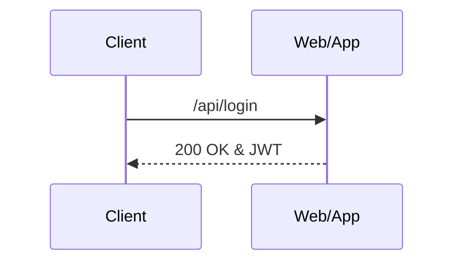

# Jwt 토큰 샘플 프로젝트

## Springboot 2.6.5, Java 8 (Compile), Kotlin 1.6.10 (코틀린은 kotlin branch)

### basic flow
- 앱/웹은 사용자가 광고를 클릭 시 access 토큰을 보내는지 확인한다.
  - 토큰이 없으면 서버로 /api/login 요청에 userId, CI 를 body에 담아 보낸다.
    - 이 때, 원래 보내기로 한 url을 query string 으로 보낸다.
  - 토큰이 있으면 서버로 협의한 api 를 보낸다.
- 서버는 /api/login 요청을 받으면, userId 와 CI 를 가지고 MAP 에서 검증을 실시한다.
  - MAP 검증에 성공하면 유저의 정보(나이, 성별 등)를 가지고 access token 을 생성하고, refresh token 도 생성해 앱/웹에 응답한다.
    - 이 때, 서버는 받은 query string 의 url 을 가지고 서버 내부에서 로직을 처리한다.
  - MAP 검증에 실패하면 401 에러를 응답한다.
- 서버는 협의한 api 를 받으면, access token 을 검증한다.
  - 검증에 성공하면 서버 내부에서 관련 로직을 처리한다.
  - 검증에 실패하면 401 에러를 응답한다.
  - 만료된 access token 이면, 웹/앱에 refresh token 을 요청하는 api 로 redirect 한다. 이 때, 원래 요청한 url을 query string 으로 보낸다.
- 앱/웹은 refresh token 을 요청하는 api 를 받으면, 서버의 /api/refresh api로 refresh token 을 보낸다. 이 때, 받은 query string 을 다시 서버로 query string 으로 보낸다.
- 서버는 /api/refresh api 로 refresh token 을 받으면, refresh token 을 검증한다.
  - 검증에 성공하면, access token 과 refresh token 을 새로 생성하여 앱/웹에 보낸다. (RTR 전략)
  - 검증에 실패하면 401 에러를 응답한다.
  - 만료된 refresh token 이면, 앱/웹에 /api/login 으로 요청해달라는 api 보낸다. 이 때, 원래 요청한 url 을 query string 으로 보낸다. 

mermaid markdown 으로 sequence diagram 작성하기
https://newdevsguide.com/2023/04/10/mermaid-sequence-diagrams/
